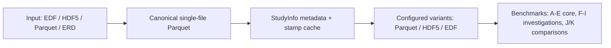

# Benchmark Report

_Generated from `2026-03-23T22-57-55_benchmark_results.json` (run `2026-03-23T22-57-55`)._

This report is automatically generated from benchmark result JSON and is intended to replace manual Markdown edits.

## Run Overview

### Technical Remarks

- Missing sections are called out explicitly, so partial benchmark runs still produce a readable report.
- Throughput uses the theoretical decoded float32 payload size: `rows × channels × 4 bytes`.
- `wall_clock_seconds` is the warm-cache-leaning median across repetitions.
- `first_wall_clock_seconds` records the first repetition as the closest available cold-start proxy without explicit OS cache eviction.
- `peak_rss_mib` reports sampled peak process resident memory when available.
- HDF5 timings include a benchmark-specific `chunk_index` helper, so they represent a best-case HDF5 seek/read path rather than plain generic HDF5 without that helper.

| Property | Value |
| --- | --- |
| Study | suppression_study |
| Channels | 46 |
| Sample rate | 256.0 Hz |
| Duration | 12.86 h (11,854,000 samples) |
| System | Windows 11 / Python 3.12.9 / 12 CPU threads / 31.7 GiB RAM |
| Categories present | `baseline_channel_subset`, `baseline_full_study`, `baseline_random_access`, `baseline_window_scaling`, `channel_subset`, `compression`, `filter_pipeline_full`, `int32_storage`, `precision_loss`, `random_access`, `remontage`, `remote_query`, `remote_query_full_study`, `sliding_fft_full`, `window_scaling` |

## Executive Summary

Benchmark rows: **79** across **15** categories.

| Area | Winner | Result |
| --- | --- | --- |
| Random access (warm-cache-leaning median 1-minute read) | pq_30m_lz4 | 0.0701s |
| 4-channel subset | hdf5_col_30m | 0.0460s |
| Full-study filter pipeline | pq_30m_lz4 | 30.88s |
| Peak window-scaling throughput | pq_30m_lz4 @ 3600s | 329.9 MiB/s |

## Key Observations

- **Random access:** pq_30m_lz4 has the lowest warm-cache-leaning median 1-minute read time at 0.0701s, about 1.81× faster than canonical.
- **Compression trade-off:** smallest Parquet artifact is zstd_9 at 624.4 MiB, while the fastest warm-cache 1-minute read is snappy at 0.0795s.
- **Int32 variants:** the most compact measured variant is int32_nanovolt (zstd) at 594.3 MiB; its reported SNR vs float32 is 144.36 dB.
- **Remote access:** the fastest remote query path in this run is duckdb_remote for 10-20 (19ch) at 0.7630s total over 2 windows.

## A. Random Access

**What it tests:** Repeated all-channel reads of the same 60-second window from different positions in the study.

**What varies:** Read position (`0%`, `50%`, `75%`, `95%`).

**What stays fixed:** Window size, channel count, and baseline format/layout readers.

**Question answered:** How sensitive is each format to where in the study a random read occurs?

pq_30m_lz4 has the lowest warm-cache-leaning median 1-minute read time across read positions at 0.0701s.

| Position | pq_30m_lz4 | hdf5_col_30m | canonical |
| --- | --- | --- | --- |
| 0% | 0.0624s (first 0.2306s; peak 508.7 MiB) / 43.2 MiB/s | 0.3796s (first 0.3853s; peak 368.4 MiB) / 7.1 MiB/s | 0.1430s (first 0.1526s; peak 399.8 MiB) / 18.9 MiB/s |
| 50% | 0.0557s (first 0.0632s; peak 534.0 MiB) / 48.4 MiB/s | 0.3756s (peak 369.1 MiB) / 7.2 MiB/s | 0.1114s (first 0.1362s; peak 484.5 MiB) / 24.2 MiB/s |
| 75% | 0.0778s (first 0.0785s; peak 538.0 MiB) / 34.6 MiB/s | 0.4340s (first 0.4622s; peak 368.6 MiB) / 6.2 MiB/s | 0.0851s (peak 504.3 MiB) / 31.7 MiB/s |
| 95% | 0.1278s (peak 542.4 MiB) / 21.1 MiB/s | 0.3404s (first 0.5071s; peak 369.2 MiB) / 7.9 MiB/s | 0.1418s (first 0.1538s; peak 501.6 MiB) / 19.0 MiB/s |

## B. Channel Subset

**What it tests:** Reads of the same 60-second window while requesting fewer channels.

**What varies:** Number of requested channels.

**What stays fixed:** Read position, window size, and baseline format/layout readers.

**Question answered:** Which formats benefit most when the workload only needs a subset of channels?

4 channels → hdf5_col_30m is fastest at 0.0460s. 10 channels → pq_30m_lz4 is fastest at 0.0909s. all channels → pq_30m_lz4 is fastest at 0.0880s.

| Channels | pq_30m_lz4 | hdf5_col_30m |
| --- | --- | --- |
| 4 | 0.0873s (first 0.0789s; peak 386.6 MiB) / 2.7 MiB/s | 0.0460s (peak 377.4 MiB) / 5.1 MiB/s |
| 10 | 0.0909s (first 0.0917s; peak 389.5 MiB) / 6.4 MiB/s | 0.1497s (peak 378.2 MiB) / 3.9 MiB/s |
| all | 0.0880s (first 0.1836s; peak 389.5 MiB) / 30.6 MiB/s | 0.3883s (peak 382.2 MiB) / 6.9 MiB/s |

## C. Re-montage

**What it tests:** A read followed immediately by bipolar montage computation.

**What varies:** Storage format/layout.

**What stays fixed:** Window size, channel set, and the montage operation itself.

**Question answered:** Once downstream signal processing is included, how much of total time is storage I/O versus lightweight computation?

Montage is a relatively small fraction of end-to-end time in this benchmark (average 0.5% of total wall time).

| Format | Read | Montage | Total | Montage share |
| --- | --- | --- | --- | --- |
| pq_30m_lz4 | 0.2435s | 0.0018s | 0.2453s (first 0.3220s; peak 374.5 MiB) | 0.7% |
| hdf5_col_30m | 0.4342s | 0.0014s | 0.4355s (first 0.4354s; peak 376.3 MiB) | 0.3% |

## D.1 Full-Study Filter Pipeline

**What it tests:** End-to-end full-study read, montage, and digital filtering.

**What varies:** Storage format/layout.

**What stays fixed:** Entire study duration, channel set, filter pipeline, and processing order.

**Question answered:** Which format is best for whole-study offline processing workloads that must read and transform all signal data?

For the full-study read → montage → filter pipeline, pq_30m_lz4 is fastest at 30.88s.

| Format | Read | Montage | Filter | Total | Throughput |
| --- | --- | --- | --- | --- | --- |
| pq_30m_lz4 | 23.57s | 2.047s | 5.253s | 30.88s (peak 929.2 MiB) | 62.9 MiB/s |
| hdf5_col_30m | 65.53s | 1.558s | 5.105s | 72.20s (peak 946.3 MiB) | 26.9 MiB/s |

## D.2 Sliding FFT

**What it tests:** The same full-study read/filter pipeline plus overlapping FFT window computation.

**What varies:** Storage format/layout.

**What stays fixed:** Study duration, preprocessing pipeline, FFT window/stride, and channel set.

**Question answered:** How much does storage choice matter once a heavier downstream spectral-analysis workload is layered on top?

This stage computed 21,596 overlapping FFT windows across the full study.

| Format | Read | Montage | Filter | FFT | Total |
| --- | --- | --- | --- | --- | --- |
| pq_30m_lz4 | 19.03s | 1.115s | 4.429s | 15.22s | 40.43s (peak 1,019.6 MiB) |
| hdf5_col_30m | 41.07s | 0.9430s | 3.379s | 11.04s | 56.92s (peak 1,029.6 MiB) |

## E. Window Scaling

**What it tests:** All-channel reads from the middle of the study while increasing requested window size.

**What varies:** Window size.

**What stays fixed:** Read position, channel count, and baseline format/layout readers.

**Question answered:** How does each format transition from small random reads to large sustained reads?

Best measured throughput is 329.9 MiB/s from pq_30m_lz4 at a 3600s window.

| Window | pq_30m_lz4 | hdf5_col_30m |
| --- | --- | --- |
| 10s | 6.1 MiB/s | 2.2 MiB/s |
| 30s | 14.8 MiB/s | 5.1 MiB/s |
| 60s | 33.8 MiB/s | 11.8 MiB/s |
| 300s | 122.0 MiB/s | 29.1 MiB/s |
| 900s | 237.6 MiB/s | 75.4 MiB/s |
| 1800s | 253.7 MiB/s | 147.1 MiB/s |
| 3600s | 329.9 MiB/s | 203.6 MiB/s |

## F. Compression

**What it tests:** Parquet codec tradeoffs between read speed and resulting artifact size.

**What varies:** Codec (`none`, `snappy`, `zstd`, `lz4`).

**What stays fixed:** Signal data, window size, and Parquet layout.

**Question answered:** Which Parquet codec gives the best balance between storage efficiency and read performance?

Against a raw float32 baseline of 2,170.5 MiB, the smallest Parquet artifact is zstd_9 at 624.4 MiB. The fastest warm-cache 1-minute read is snappy at 0.0795s.

| Codec | 1-minute read | Artifact size | Ratio vs raw float32 |
| --- | --- | --- | --- |
| zstd_9 | 0.4376s (first 0.5014s; peak 1,845.6 MiB) | 624.4 MiB | 3.48× |
| zstd_3 | 0.4255s (first 0.7888s; peak 1,836.3 MiB) | 629.3 MiB | 3.45× |
| snappy | 0.0795s (first 0.0768s; peak 1,732.0 MiB) | 718.9 MiB | 3.02× |
| lz4 | 0.4425s (first 0.6126s; peak 1,877.0 MiB) | 738.9 MiB | 2.94× |
| none | 0.4498s (first 0.7476s; peak 1,813.5 MiB) | 820.1 MiB | 2.65× |

## G. Precision Loss

**What it tests:** Float32 → EDF 16-bit → float32 round-trip quantization error.

**What varies:** Channel signal statistics.

**What stays fixed:** Window size and round-trip conversion procedure.

**Question answered:** What numeric precision is lost when using EDF-style 16-bit storage instead of float32?

EDF round-trip quantization for a 60s window produced worst-case max absolute error 0.03268992 µV with average SNR 94.15 dB across 46 channels.

Top channels by max absolute error:

| Channel | Max abs error (µV) | RMS error (µV) | SNR (dB) |
| --- | --- | --- | --- |
| DC2 | 0.03268992 | 0.01795972 | 105.32 |
| DC3 | 0.03017531 | 0.01755604 | 105.58 |
| DC1 | 0.02766070 | 0.01632583 | 105.99 |
| DC4 | 0.02263148 | 0.01337124 | 104.11 |
| X2 | 0.00483166 | 0.00278872 | 88.79 |

## H. Int32 Storage

**What it tests:** Alternative int32-based storage encodings versus float32 for size, precision, and read speed.

**What varies:** Encoding mode, codec, and read path.

**What stays fixed:** Signal data and comparison baseline.

**Question answered:** Can int32 encodings reduce storage cost while preserving acceptable fidelity and performance?

The most compact measured storage mode is int32_nanovolt (zstd) at 594.3 MiB.

### H.1 Size / Precision

| Mode | Codec | Artifact size | Ratio vs raw float32 | SNR vs float32 |
| --- | --- | --- | --- | --- |
| int32_nanovolt | zstd | 594.3 MiB | 3.65× | 144.36 |
| float32 | zstd_3 | 629.3 MiB | 3.45× | inf |
| int32_calibrated | zstd | 634.2 MiB | 3.42× | 159.83 |
| int32_nanovolt | snappy | 671.0 MiB | 3.23× | 144.36 |
| int32_calibrated | snappy | 718.4 MiB | 3.02× | 159.83 |
| int32_nanovolt | none | 727.2 MiB | 2.98× | 144.36 |
| int32_calibrated | none | 774.6 MiB | 2.80× | 159.83 |

### H.2 Representative Read Performance

| Mode | Read method | Codec | 1-minute read | Throughput |
| --- | --- | --- | --- | --- |
| float32 | — | zstd_3 | 0.2921s (first 0.2890s; peak 1,915.0 MiB) | 9.2 MiB/s |
| int32_nanovolt | numpy | zstd | 0.4025s (first 0.2957s; peak 1,862.4 MiB) | 6.7 MiB/s |
| int32_calibrated | numpy | zstd | 0.4397s (first 0.7616s; peak 1,846.5 MiB) | 6.1 MiB/s |

## I. Remote Query

**What it tests:** Remote-access workflows for retrieving windows over the network.

**What varies:** Access method and artifact format.

**What stays fixed:** Window count, window duration, and requested channel subsets.

**Question answered:** For remote/cloud access, when is query-in-place better than full-file download first?

Received settings: n_random_points=2; window_sec=600s; full_study_chunk_sec=3600s.

All reported remote timings are direct measurements.

| Method | Format | Channel subset | Total time | Avg/window | Throughput |
| --- | --- | --- | --- | --- | --- |
| duckdb_remote | parquet_single_file_lz4 | 10-20 (19ch) | 0.7630s (peak 2,150.1 MiB) | 0.3810s | 29.2 MiB/s |
| duckdb_remote | Parquet int32 nV snappy | 10-20 (19ch) | 0.9070s (peak 2,140.0 MiB) | 0.4540s | 24.5 MiB/s |
| duckdb_remote | Parquet float32 snappy | 10-20 (19ch) | 3.381s (peak 1,926.3 MiB) | 1.691s | 6.6 MiB/s |
| duckdb_remote | parquet_single_file_lz4 | all | 4.218s (peak 2,197.2 MiB) | 2.109s | 12.8 MiB/s |
| duckdb_remote | Parquet float32 snappy | all | 7.529s (peak 1,964.4 MiB) | 3.764s | 7.2 MiB/s |
| duckdb_remote | Parquet int32 nV snappy | all | 10.53s (peak 2,193.2 MiB) | 5.267s | 5.1 MiB/s |

## J. Tuned Format Comparison

This group compares matched block-size variants generated specifically for Benchmark J.

### J.1 Random Access

**What it tests:** A single 60-second all-channel read at mid-study across tuned block sizes.

**What varies:** On-disk block size and tuned storage variant.

**What stays fixed:** Read position, read size, and channel count.

**Question answered:** Which tuned layout is best for small random-access reads?

*This category was not present in the input results file.*

### J.2 Channel Subset

**What it tests:** A 60-second read of only 4 channels across tuned block sizes.

**What varies:** On-disk block size and tuned storage variant.

**What stays fixed:** Read position, read duration, and requested channel count.

**Question answered:** Which tuned layout best supports selective channel retrieval?

*This category was not present in the input results file.*

### J.3 Throughput vs Window Size

**What it tests:** How read throughput for each format scales as the requested window grows, from small random reads (10s) to large sequential reads (3600s).

**What varies:** Requested window size and tuned storage format.

**What stays fixed:** Channel count, read position (mid-study), and comparison method. The best-performing block size is selected per cell.

**Question answered:** Which tuned format scales best as the read window grows?

*This category was not present in the input results file.*

### J.4 Full-Study Sequential Read

**What it tests:** Reading the entire study chunk-by-chunk using the tuned variants.

**What varies:** On-disk block size and tuned storage variant.

**What stays fixed:** Full-study coverage, channel count, and sequential chunked access pattern.

**Question answered:** Which tuned layout is best for whole-study scans rather than isolated random reads?

*This category was not present in the input results file.*

## K. Baseline Format Comparison

This group runs the Benchmark J workload suite on the resolved baseline input artifact(s) only, without generating tuned comparison variants.

Reported throughput values use the theoretical decoded float32 payload size: rows × channels × 4 bytes.

### K.1 Random Access

**What it tests:** A single 60-second all-channel read at mid-study on the baseline input artifact.

**What varies:** Baseline input format.

**What stays fixed:** Read position, read size, and channel count.

**Question answered:** How does the baseline input format perform on the same random-access workload used in Benchmark J?

| Artifact | Baseline input Parquet |
| --- | --- |
| Baseline input | 0.0754s (first 0.1048s; peak 1,893.4 MiB) / 35.8 MiB/s |

### K.2 Channel Subset

**What it tests:** A 60-second read of only 4 channels on the baseline input artifact.

**What varies:** Baseline input format.

**What stays fixed:** Read position, read duration, and requested channel count.

**Question answered:** How well does the baseline input format support selective channel retrieval on the J-style workload?

| Artifact | Baseline input Parquet |
| --- | --- |
| Baseline input | 0.0631s (peak 1,894.6 MiB) / 3.7 MiB/s |

### K.3 Throughput vs Window Size

**What it tests:** How read throughput for the baseline input artifact scales as the requested window grows, from small random reads (10s) to large sequential reads (3600s).

**What varies:** Requested window size.

**What stays fixed:** Channel count, read position (mid-study), and the use of the baseline input artifact only.

**Question answered:** How does the baseline input format scale on the same workload family used for Benchmark J?

Each cell shows the measured throughput for the baseline input artifact(s) at that window size.

| Window | Baseline input Parquet |
| --- | --- |
| 10s | 7.3 MiB/s |
| 30s | 16.9 MiB/s |
| 60s | 42.4 MiB/s |
| 300s | 123.5 MiB/s |
| 900s | 217.2 MiB/s |
| 1800s | 228.4 MiB/s |
| 3600s | 346.6 MiB/s |

### K.4 Full-Study Sequential Read

**What it tests:** Reading the entire study chunk-by-chunk using the baseline input artifact.

**What varies:** Baseline input format.

**What stays fixed:** Full-study coverage, channel count, and sequential chunked access pattern.

**Question answered:** How does the baseline input artifact perform on whole-study scans compared with the tuned variants in Benchmark J?

| Artifact | Baseline input Parquet |
| --- | --- |
| Baseline input | 8.718s (peak 2,400.3 MiB) / 238.6 MiB/s |

Benchmark K runs the Benchmark J workload family on the resolved baseline input artifact(s) without generating tuned comparison variants.
